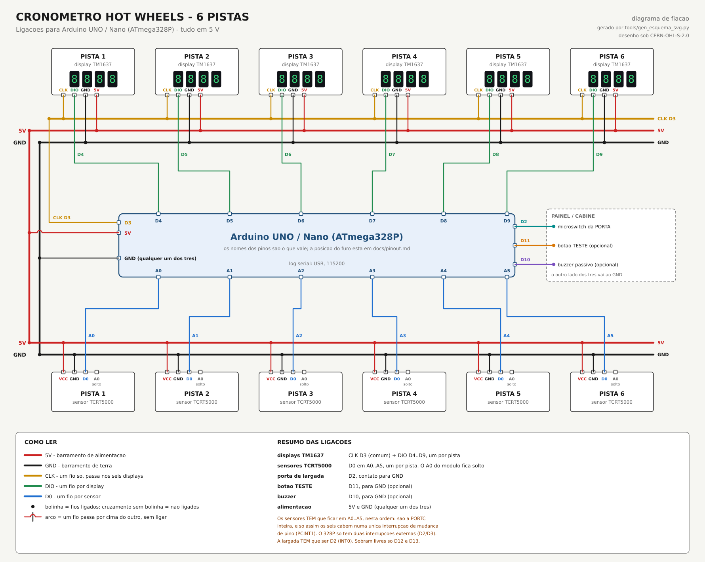

# Cronômetro Hot Wheels — 6 raias

Cronômetro de largada e chegada para pista de carrinhos com seis raias. Um
microswitch na porta de largada marca o `t0`, um sensor infravermelho
**TCRT5000** no fim de cada raia marca a chegada, e seis displays **TM1637**
mostram a colocação (1 a 6) e depois o tempo de cada carro.



## Duas versões, mesmo comportamento

| | [`cronometro-rasp-pico`](cronometro-rasp-pico/) | [`cronometro-arduino`](cronometro-arduino/) |
| --- | --- | --- |
| Placa | Raspberry Pi Pico / RP2040 (inclusive a roxa) | Arduino UNO / Nano |
| Linguagem | C, Pico SDK 1.5.1 | C++, Arduino (um `.ino` só) |
| Tensão | 3,3 V | 5 V |
| Simulador | Wokwi no VS Code | Wokwi no VS Code **ou** wokwi.com, sem instalar nada |
| Fiação | [SVG](cronometro-rasp-pico/docs/fiacao-pico.svg) | [SVG](cronometro-arduino/docs/fiacao-arduino.svg) |
| Esquema KiCad 10 | [projeto](cronometro-rasp-pico/kicad/) · [PDF](cronometro-rasp-pico/docs/esquema-kicad.pdf) | [projeto](cronometro-arduino/kicad/) · [PDF](cronometro-arduino/docs/esquema-kicad.pdf) |
| Teto de raias | 9 | 6 |

A máquina de estados, os tempos, os sons e o formato do placar são os mesmos
nas duas. O que a plataforma obrigou a mudar está em
[diferencas-rp2040.md](cronometro-arduino/docs/diferencas-rp2040.md).

**Para só ver funcionando:** a versão Arduino no wokwi.com — dois arquivos
colados e play.

## Documentação que vale para as duas

- [Lista de material e cuidados elétricos](cronometro-rasp-pico/docs/bom.md) —
  por que o sensor é infravermelho e não LDR (a disputa mais apertada do vídeo
  de referência foi decidida por 17 ms), como montar o TCRT5000, e a conta de
  consumo.
- [Notas do projeto](cronometro-rasp-pico/NOTAS.md) — decisões, medidas e
  armadilhas, para não refazer o raciocínio depois.

## Desenhos gerados

Os diagramas de fiação e os esquemas do KiCad saem de scripts; não edite à
mão. Da raiz do repositório:

```bash
python tools/gen_esquema_svg.py
```

```bash
python tools/gen_kicad_sch.py --verificar
```

O primeiro confere, segmento a segmento, que nenhum fio de sinal cruza outro.
O segundo precisa do KiCad 10 instalado: roda o ERC e exporta o netlist pelo
próprio KiCad, conferindo rede por rede contra a pinagem do firmware — o ERC
sozinho só prova regra elétrica; é o netlist que prova que cada fio chega no
pino certo. Os dois saem com erro se a conferência falhar.

## Pacotes de release

Cada [release](https://github.com/lrrosa/cronometro-hotwheels/releases) traz
um zip por placa, com o que interessa a quem vai montar: `LEIA-ME.txt` com a
montagem em ordem, fiação em SVG e PNG, lista de material, pinagem, esquema
em PDF e o projeto KiCad, o simulador já com o binário, o código e as
licenças. O do Pico traz também quatro `.uf2` prontos — ponto decimal ×
polaridade do sensor —, para gravar sem instalar o SDK.

Os zips saem de um script, a partir de um commit limpo:

```bash
python tools/empacotar_release.py 1.0.0
```

Ele compila as quatro variantes do Pico e o sketch do Arduino, renderiza os
diagramas em PNG pelo Edge headless, troca os links que apontariam para fora
do pacote por URLs do GitHub fixadas na tag e confere que todo link relativo
que sobrou existe dentro do zip.

Precisa do Pico SDK 1.5.1, do `arduino-cli` com o core `arduino:avr` e do
Edge. No Windows, rode com um Python que **não** seja o da Microsoft Store:
os processos filhos dele não enxergam o core instalado do `arduino-cli`. O
Python que vem com o Pico SDK serve.

## Licença

Projeto com **licença dupla**, a mesma do
[RetroSC Pong](https://github.com/lrrosa/retrosc-pong) — ver [`NOTICE`](NOTICE)
para o detalhamento por arquivo:

- **Software** (firmwares, geradores em `tools/`, circuito do simulador) —
  **[GPL-3.0-or-later](LICENSE)** (`SPDX-License-Identifier: GPL-3.0-or-later`).
- **Hardware** (projetos e esquemas do KiCad, diagramas de fiação, `bom.md`,
  `pinout.md`) — **[CERN-OHL-S-2.0](LICENSE-HARDWARE.txt)**
  (`SPDX-License-Identifier: CERN-OHL-S-2.0`), a variante *Strongly
  Reciprocal* da CERN Open Hardware Licence.

As duas são **recíprocas** (copyleft): trabalhos derivados devem manter a mesma
licença e disponibilizar as fontes correspondentes — código, no caso do
software; arquivos de projeto, no caso do hardware.

Copyright (C) 2026 Leonardo Roman da Rosa.
