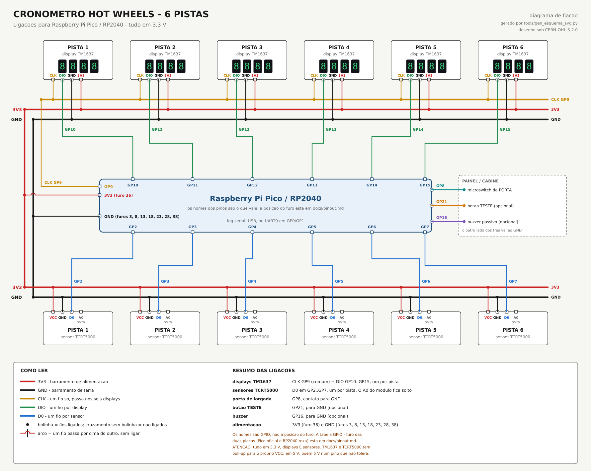

# Cronômetro Hot Wheels — 6 pistas (RP2040)

Cronômetro de largada e chegada para pista de carrinhos com 6 raias, no
Raspberry Pi Pico / RP2040 (testado na compilação com o **Pico SDK 1.5.1**,
o mesmo do projeto Pong).

- Um **microswitch** na porta que solta os carrinhos marca o `t0`.
- Um **sensor infravermelho TCRT5000** no fim de cada raia marca a chegada daquele
  carro, pela saída digital D0. A escolha do infravermelho em vez
  do LDR está justificada com números em [docs/bom.md](docs/bom.md) — em
  resumo: a prova de referência teve colocações decididas por 17 ms, e a
  dispersão de um LDR para outro é dessa mesma ordem.
- Seis **displays TM1637** mostram a **colocação** (1 a 6) assim que cada
  carro cruza, e depois o **tempo em segundos** (`3721` = 3,721 s; se os seus
  módulos tiverem ponto por dígito, `DISPLAY_PONTO_DECIMAL = 1` mostra
  `3.721`, como no vídeo original).

Vem com um **simulador Wokwi** pronto (`diagram.json` + `wokwi.toml`) — dá
para rodar a corrida inteira no VS Code antes de comprar ou soldar nada.
Passo a passo em [docs/como-simular.md](docs/como-simular.md).

> Existe a **mesma coisa para Arduino UNO/Nano** em
> [`../cronometro-arduino`](../cronometro-arduino/), num arquivo `.ino` só,
> que roda no wokwi.com sem instalar nada. O que muda entre as duas está em
> [diferencas-rp2040.md](../cronometro-arduino/docs/diferencas-rp2040.md).

## Desenhos

- [**Diagrama de fiação**](docs/fiacao-pico.svg) — módulos, barramentos e cada fio com o
  nome do pino. É o que se segue na montagem.
- [**Esquema KiCad 10**](kicad/) — abra `kicad/cronometro-rasp-pico.kicad_pro`; também
  exportado em [SVG](docs/esquema-kicad.svg) e [PDF](docs/esquema-kicad.pdf).



Os dois são gerados pelos scripts em `tools/`, na raiz do repositório — ver o
README de lá.

## Como se comporta

| Estado | Displays | Sai daqui quando |
| --- | --- | --- |
| **Armado** | `----` fixo (ou piscando, se a porta estiver aberta) | a porta abre |
| **Correndo** | cronômetro correndo em cada raia; quem chega troca para a colocação | todos chegam, ou 8 s depois do 1º, ou 15 s no total |
| **Resultado** | alterna colocação (4,5 s) ↔ tempo (7 s) | a porta fecha (ou o botão TESTE) |

- Carro que não cruza o sensor aparece como `dnF` na colocação e `----` no tempo.
- Com a porta fechada, o placar fica na tela por dois ciclos inteiros
  (`RESULTADO_MIN_MS`, 23 s) antes de rearmar sozinho; com a porta aberta,
  fica até alguém fechá-la.
- **Fechar a porta rearma** — não precisa de botão para a próxima prova.
- Ao ligar, cada display acende **tudo** (segmentos e pontos) e depois o
  número da própria raia:
  se um ficar apagado ou mostrar o número de outra raia, o erro está no
  DIO dele, não no firmware. O primeiro quadro também revela se o módulo liga
  um ponto por dígito — ver `DISPLAY_PONTO_DECIMAL`.

### Corrida demo

Para ver o painel funcionando sem carrinho nenhum (no simulador ou na
bancada), há dois atalhos, e as chegadas simuladas entram pelo **mesmo
caminho** das reais:

- segurar o botão **TESTE** por 1 s (tecla `D` no Wokwi);
- ou **segurar um carrinho sobre o sensor da raia 1** por 2 s com a prova
  armada — funciona sem botão nenhum, e de quebra confere a polaridade.

## Compilar

```powershell
& "C:\Program Files\Raspberry Pi\Pico SDK v1.5.1\pico-env.ps1"
cmake -G Ninja -B build
& "C:\Program Files\Raspberry Pi\Pico SDK v1.5.1\ninja\ninja.exe" -C build
```

Saída: `build/cronometro-rasp-pico.uf2`. Para gravar, segure BOOTSEL, ligue
o USB e copie o `.uf2` para a unidade `RPI-RP2`.

`DISPLAY_PONTO_DECIMAL` e `SENSOR_NIVEL_CARRO` também podem ser escolhidos na
configuração do CMake, sem editar o `config.h` — é assim que o release gera
os quatro `.uf2` prontos:

```powershell
cmake -G Ninja -B build -DPONTO_DECIMAL=1 -DSENSOR_NIVEL=1
```

As opções ficam no cache do CMake. Para voltar ao que diz o `config.h`, passe
as duas vazias (`-DPONTO_DECIMAL= -DSENSOR_NIVEL=`) ou apague a pasta `build`.

## Ligações

Resumo — a tabela completa, com a posição física do furo em cada módulo
(Pico oficial e RP2040 roxa), está em [docs/pinout.md](docs/pinout.md).

| Função | GPIO |
| --- | --- |
| Sensores TCRT5000 (D0) das raias 1 a 6 | GP2, GP3, GP4, GP5, GP6, GP7 |
| Microswitch da porta | GP8 |
| TM1637 **CLK** (comum aos seis) | GP9 |
| TM1637 DIO das raias 1 a 6 | GP10, GP11, GP12, GP13, GP14, GP15 |
| Buzzer passivo (opcional) | GP16 |
| Botão TESTE / rearma (opcional) | GP21 |
| Log serial | USB, e UART0 em GP0/GP1 |

> **Tudo em 3,3 V — displays e sensores.** O TM1637 e o TCRT5000 têm
> pull-up para o VCC do próprio módulo: alimentados em 5 V, põem 5 V num
> GPIO do RP2040, que **não** é tolerante a 5 V. Ver [docs/bom.md](docs/bom.md),
> que também explica por que vale usar um regulador 3,3 V separado.

Os seis displays dividem o **mesmo CLK**: o TM1637 não tem endereço, quem
seleciona o chip é a linha DIO. Enquanto se escreve numa raia, os outros
cinco veem o clock mas com o DIO parado em nível alto — sem condição de
START, eles ignoram tudo. São 7 pinos em vez de 12, e trocar para um CLK
por display é só mudar a tabela em `src/config.c`.

## Arquivos

```
src/config.{h,c}    pinos, polaridades e tempos — o que se mexe
src/tm1637.{h,c}    protocolo de dois fios do display
src/display.{h,c}   fonte de 7 segmentos e formatação (tempo, colocação)
src/cronometro.{h,c} máquina de estados da prova
src/som.{h,c}       bips no buzzer (não bloqueantes)
src/main.c          init + laço principal
diagram.json        circuito do simulador Wokwi (gerado, não editado a mão)
tools/gen_diagram.py  gera o diagram.json e confere o roteamento dos fios
wokwi.toml          aponta o Wokwi para o firmware compilado
docs/               pinagem, lista de material, como simular
NOTAS.md            decisões, medidas e armadilhas do projeto
```

## Ajustes que você provavelmente vai querer mexer

Tudo em [src/config.h](src/config.h):

| Constante | Para quê |
| --- | --- |
| `N_PISTAS` | número de raias (mexa junto com as tabelas de `config.c`) |
| `SENSOR_NIVEL_CARRO` | `0` (padrão) é o TCRT5000: D0 cai com o carro. `1` se o seu lote for invertido |
| `LARGADA_NIVEL_ABERTA` | idem, para o microswitch (contato NA ou NF) |
| `DISPLAY_PONTO_DECIMAL` | `1` se o módulo tem ponto por dígito, `0` (padrão) se só tem dois-pontos no meio |
| `TM1637_BRILHO` | 0 a 7 — mexe direto no consumo, ver `docs/bom.md` |
| `TEMPO_MIN_MS` | piso de tempo abaixo do qual a chegada é considerada ruído |
| `ESPERA_APOS_1o_MS` | quanto tempo esperar os retardatários depois do 1º |
